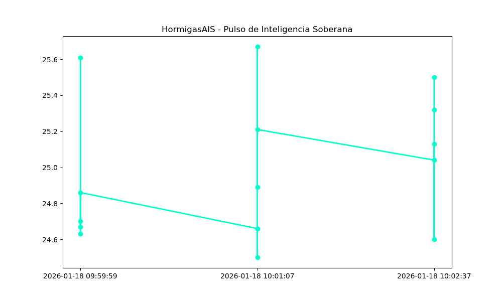

# 🐜 HormigasAIS - Nodo Escuela
## 🛡️ Infraestructura de Inteligencia Distribuida Soberana

### 📊 Rendimiento del Enjambre (Real-Time CORE)

> **Estado:** Operativo validado por protocolo LBH.
> **Última Actualización: 2025-12-28 21:13:28 CST (LBH-Validated)

---
© 2025 HormigasAIS - San Miguel, El Salvador.

---
## ✅ ESTADO DE AUDITORÍA: ANTIFRÁGIL

# 🐜 Reporte de Auditoría: Ecosistema Antifrágil
**Fecha:** 2025-12-28 20:37:49
**Agente Auditor:** Estudiante 10 (Delegada)

## 🛡️ Estado de Resiliencia LBH
- **Protocolo Fallback:** Activo y Validado (Nivel 4).
- **Soberanía de Datos:** Firma CLHQ detectada y vinculada.
- **Estado de la Colonia:** Antifrágil (Capaz de recuperarse ante desorden).

## 📊 Validación Técnica
El Nodo Escuela ha verificado la integridad de las 7 terminales. 
La sincronización con el `xoxo-lbh-adapter` es nominal.

---
**Firma Digital del Fundador requerida para validación final.**
